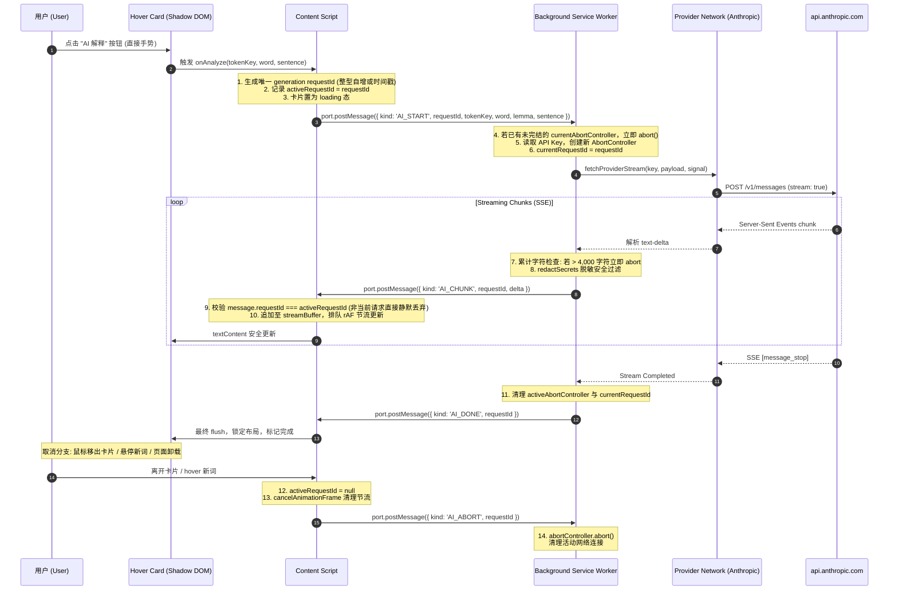

# ADR 002: AI 语境释义架构设计、流式协议与协议冻结审查 (Milestone 4)

## 状态
**协议已冻结 (Frozen Specification - Milestone 4 V1)**
经架构设计审查与产品决策确认，本规范作为 Milestone 4 编码实现的唯一协议依据。在正式编写生产代码前，严禁修改任何生产代码 (`src/`)。

---

## 一、已确认的产品决策 (Frozen Product Decisions - 方案 B)

经评估与用户明确确认，Milestone 4 采用 **方案 B (Hover Card 内点击“AI 解释”按钮)**：

1. **零自动网络请求**: 鼠标悬停 (Hover) 本身绝对不产生任何 AI 网络请求与 Token 消耗。
2. **本地词典即时响应**: 本地 5.7 万词离线字典查询结果继续保持秒级即时展示。
3. **显式用户操作**: AI 解释是明确的用户主动操作，用户必须在卡片内主动点击“AI 解释”按钮才发起调用。
4. **单活动请求原则**: 第一版严格限制**同一时间全局至多一个活动 AI 请求**。不设计多路复用，绝不允许 Request A 与 Request B 同时在后台并发。
5. **切换即取消**: 用户将鼠标切换至另一个 Token 时，前一个请求必须先进入 abort/失效流程，旧响应绝对不得污染新卡片。
6. **边界收敛**:
   - 第一版**不做自动预取 (No Prefetch)**。
   - 第一版**不做快捷键触发 (No Shortcuts)**。
   - 第一版**不做重新生成 (No Regenerate)**。
   - 第一版**暂不做持久化 / LRU 缓存 (No Cache)**，保持状态极简。
   - 第一版**不引入 Markdown / HTML 富文本渲染**，100% 采用 DOM 原生 `textContent`。
   - 第一版**不引入任何新的第三方依赖**（零新增 npm 包）。
   - **不增加 Swift / native bridge**，纯 WebExtension 架构。
   - **不增加第二个 AI Provider**，严格聚焦 Anthropic。

---

## 二、Safari Technology Preview Service Worker 生命周期客观评级

针对 Safari Technology Preview (Release 253, WebKit 22626.1.8.19.2) 的后台 Worker 生命周期，严禁使用推测替代验证，客观评级如下：

| WebKit / Service Worker 行为假设 | 证据与当前状态 | 评级分类 | 架构与实现应对措施 |
| :--- | :--- | :--- | :--- |
| **1. `fetch` / `ReadableStream` 一定保持 Service Worker 存活** | 缺少 Apple / WebKit 官方白纸黑字保证与真实实机长慢流断线测试。在流传输停滞时，WebKit Watchdog 是否会强杀 Worker 尚无实机证据。 | **UNVERIFIED** | **实现时必须通过真实 STP 慢流/停流实验验证**。Background 端必须配置硬性 `AbortSignal.timeout(60000)`，超时主动中断，不依赖浏览器的非确定性行为。 |
| **2. 活跃网络连接一定不会被 Worker suspension 中断** | 尚无实机证据证明当网络高延迟卡顿时，底层 WebKit NetworkProcess 是否与 Worker 进程解耦并保持。 | **UNVERIFIED** | **实现时必须通过真实 STP 慢流/停流实验验证**。Content Script 端需监听连接异常并在断开时向用户反馈重试提示。 |
| **3. `AbortController.abort()` 一定会立即释放底层 TCP/网络资源** | JS 层原生支持 `AbortController` 且语法调用正常，但底层 WebKit NetworkProcess 是否立即向服务器发送 TCP RST/FIN 释放 socket 仍缺乏抓包证据。 | **PARTIALLY VERIFIED** | 保持双端协作取消机制；Background 接收 abort 指令后立即执行 `.abort()` 并从活跃引用中释放。实现时可通过本地 mock server 抓包验证连接断开。 |
| **4. “约 30 秒” 这一具体生命周期空闲超时行为** | 符合 Chromium / WebKit MV3 规范草案预期，但 STP 253 具体秒数未在当前开发机实际打点测定。 | **PARTIALLY VERIFIED** | **实现时需在 STP 实机打点测定具体空闲挂起时长**。架构上假设 Worker 随时可能被休眠，任何状态必须基于消息或 Storage 即时唤醒恢复。 |

---

## 三、第一版单请求生命周期与 Port / requestId 关系



### Port 与 requestId 的关系与职责定义
1. **一个 Tab 维护单一 Port**:
   - Content Script 与 Background 之间建立专用长连接 `browser.runtime.connect({ name: 'glint:ai-stream' })`。
   - 该 Port 仅服务当前标签页的 AI 交互。
2. **单一活动请求，无多路复用**:
   - 同一时刻整个扩展仅允许运行**至多一个**活动 AI 请求。
3. **保留 `requestId` 的核心价值（世代守卫 Epoch Guard）**:
   - 虽然同一时间只运行一个请求，但网络 I/O 与 IPC 通信存在异步时延。
   - 当用户在 Token A 正在推流时快速切换至 Token B，Content Script 虽已发出 `AI_ABORT`，但在 Background 处理 abort 之前，网络管道中可能已存在正在飞向 Content Script 的残余 chunk。
   - `requestId` 作为严格递增的世代标识符（Generation ID），Content Script 收到消息时仅需简单判定：
     `if (message.requestId !== this.activeRequestId) return; // 彻底无声丢弃旧残留`
   - 这以极其低廉的成本彻底消除了竞态条件与卡片内容污染，无需设计复杂的状态同步协议。
4. **异常断开兜底**:
   - 当页面刷新、标签页关闭或导航导致 Content Script 卸载时，WebKit 触发 `port.onDisconnect`。
   - Background 监听到断开后，立即执行当前活动的 `currentAbortController.abort()`，杜绝孤儿请求在后台浪费 Token。

---

## 四、冻结的 IPC 消息协议 (IPC Payload Specification)

所有通过 Port 传输的消息严格遵循以下 TypeScript 结构，彻底剔除冗余字段：

### 1. `AI_START` (Content Script → Background)
发起单次生词 AI 解释：
```typescript
interface AiStartMessage {
  kind: 'AI_START';
  requestId: number;      // 单调递增的世代标识符 (如 1, 2, 3...)
  tokenKey: string;       // 词汇标识符 (如 "12:particle:B1")
  word: string;           // 目标单词表面写法
  lemma: string;          // 词形还原后的原型
  sentence: string;       // 精准截取的上下文原句
}
```

### 2. `AI_CHUNK` (Background → Content Script)
推送增量文本流片段：
```typescript
interface AiChunkMessage {
  kind: 'AI_CHUNK';
  requestId: number;
  delta: string;          // 本次新增的增量文本字符串
}
```

### 3. `AI_DONE` (Background → Content Script)
流式生成正常结束（**已删除冗余的 `fullText`**）：
```typescript
interface AiDoneMessage {
  kind: 'AI_DONE';
  requestId: number;      // 纯状态通知，Content Script 已在本地累加了完整文本，拒绝重复传输
}
```

### 4. `AI_ERROR` (Background → Content Script)
网络故障、鉴权失败、超时或超长截断：
```typescript
interface AiErrorMessage {
  kind: 'AI_ERROR';
  requestId: number;
  error: string;          // 经过安全脱敏的人性化错误提示
}
```

### 5. `AI_ABORT` (Content Script → Background)
用户主动取消、卡片收起或切换单词：
```typescript
interface AiAbortMessage {
  kind: 'AI_ABORT';
  requestId: number;
}
```

### 数据传输安全红线
* **API Key 绝对禁止进入 IPC 载荷**。
* **绝对不发送整个页面 DOM 或 HTML 结构**。
* **绝对不发送无关上下文或非当前句文本**。
* **绝对不发送用户历史数据或设备隐私**。

---

## 五、响应长度硬限制规范 (Response Size Limit)

不再使用模糊的“Token 等价计算”，明确第一版确定性、可测试的硬限制：

* **硬性上限阈值**: `MAX_RESPONSE_CHARS = 4,000` (以 JavaScript 字符串 `.length` 字符数为准)。
  - *理由*: 词汇释义标准场景一般在 150~400 字符。4,000 字符已足够容纳极其详尽的语法和多例句分析，同时有效防止模型复读失控或恶意网页引发内存消耗。
  - *判定成本*: 字符串长度读取为 $O(1)$，无需在每次 chunk 到达时进行 UTF-8 字节编码转换，避免 GC 内存抖动。
* **超限行为规范**:
  1. Background 在累加 `totalChars + delta.length > 4,000` 时，**立即调用 `abortController.abort()`** 掐断底层网络流。
  2. 向 Content Script 发送 `AI_ERROR`，错误信息为：`"释义内容超出长度限制 (4,000 字符)，已截断终止。"`。
  3. **UI 容错处理**: Content Script 保留已接收并渲染的局部内容，不予清空，在底部显示 `[内容已截断]` 提示，卡片退出 loading 态。
  4. 该行为高度确定且可通过自动化测试 100% 覆盖验证。

---

## 六、Prompt Injection 安全模型重新措辞

### 核心安全模型与声明
1. **基础事实认定**:
   $$\text{Webpage Text} = \text{Untrusted Input}$$
   $$\text{Webpage Text} \neq \text{System Instruction} \neq \text{Developer Instruction} \neq \text{Extension Authority} \neq \text{API Credential}$$
2. **严正声明：格式与标签不是安全边界**:
   - 在 Prompt 中采用 XML 实体标签（如 `<target_word>`、`<untrusted_context>`）或特定分隔符，**仅属于帮助模型梳理输入结构的工程手段，绝不构成密码学或架构级安全边界**。
   - 任何宣称“XML 标签可彻底防御 Prompt Injection”的论调均为伪命题。
3. **真正的架构级安全边界 (Real Security Boundaries)**:
   - **权限隔离 (Permission Isolation)**: LLM 绝对不拥有任何工具调用能力（**No Tool Use**），模型无法读取本地文件、无法调用浏览器扩展 API、无法发起额外网络。
   - **凭据隔离 (Credential Isolation)**: API Key 严格驻留在 Background `local:apiKeys`，Prompt 中零密钥、上下文零密钥，模型根本接触不到任何凭据。
   - **语境最小化 (Context Minimization)**: 严格限定仅提取当前目标词与所在单句 (`sentenceAround`)，不上传网页 DOM、不上传 Cookie、不上传用户表单输入。
   - **输出无害化 (Strict Output Handling)**: 模型的任何返回内容均被视为纯文本不可信数据，通过 `textContent` 写入 DOM，绝不作为 HTML 解析，绝不执行任何返回的脚本代码。

---

## 七、AI 响应安全渲染与结构化拆分

### 1. 渲染规范
* 宿主隔离：渲染在 `<glint-card>` Shadow DOM 内部。
* 预创建静态节点：
  - `.glint-ai-container` (AI 内容包裹层)
  - `.glint-ai-status` (状态与错误提示层)
  - `.glint-ai-body` (释义呈现层)
* **绝对禁止 `innerHTML`**: 所有内容 100% 经由 `.textContent` 写入。
* **零依赖**: 严禁引入 Markdown parser、HTML sanitizer 或富文本库。

### 2. 字段拆分与优雅降级 (Graceful Fallback)
Prompt 中引导模型以固定标号输出结构化释义：
```text
【中文简释】...
【语境含义】...
【原句翻译】...
【拓展例句】...
【例句翻译】...
```

* **流式生成阶段**:
  增量 chunk 实时通过 `textContent` 追加至 `.glint-ai-body`，用户即时看到打字机效果。
* **流式完成阶段 (`AI_DONE`)**:
  Content Script 使用轻量单遍正则对累加文本进行标号提取：
  - **若格式匹配成功**: 将各字段分别装配至卡片内预置的对应小标签中（如简释、翻译、例句分别以不同字号/颜色呈现）。
  - **若格式匹配失败（模型未遵循格式）**: **安全降级**，保持 `.glint-ai-body` 的纯文本完整展示，不抛出异常，不产生白屏。

---

## 八、Streaming UI 更新与 rAF 状态机设计

为平衡流式打字机的视觉平滑度与主线程性能，采用 `requestAnimationFrame` (rAF) 节流缓冲：

### 状态机定义
* `streamBuffer: string = ''` (当前未上屏的累积文本)
* `rafHandle: number | null = null` (活跃帧调度句柄)

### 执行流程
1. **`AI_CHUNK` 到达**:
   - 校验 `message.requestId === activeRequestId`，不匹配直接丢弃。
   - 追加字符：`streamBuffer += message.delta`。
   - 若 `rafHandle === null`，注册帧调度：
     ```typescript
     rafHandle = requestAnimationFrame(() => {
       rafHandle = null;
       bodyElement.textContent = streamBuffer;
     });
     ```
2. **`AI_DONE` 到达**:
   - 校验 `message.requestId === activeRequestId`。
   - 若存在未执行的 `rafHandle`，调用 `cancelAnimationFrame(rafHandle)` 并置空。
   - 执行最终 flush：`bodyElement.textContent = streamBuffer`。
   - 触发结构化正则匹配与完成态切换。
3. **`AI_ABORT` / `AI_ERROR` 触发**:
   - 若存在未执行的 `rafHandle`，调用 `cancelAnimationFrame(rafHandle)` 并置空。
   - 清理活动 `activeRequestId = null`。
4. **Token 切换 / 卡片关闭**:
   - 立即清理句柄：`cancelAnimationFrame(rafHandle); rafHandle = null;`
   - 重置缓冲区：`streamBuffer = ''`。

> [!NOTE]
> **性能客观声明**:
> rAF 机制确保了 DOM 写入频率不高于屏幕刷新率（通常 60Hz / 120Hz），避免了一次 chunk 触发一次 layout。然而，在复杂宿主网页中，高度不断变化的卡片对 WebKit 真实重排 (Layout) 和垃圾回收 (GC) 的实际影响，**目前属于 UNVERIFIED**，必须在后续真实 Safari Technology Preview 性能基准测试中实测验证。

---

## 九、上下文边界 (`sentenceAround` 规则冻结)

严格锁定语境范围为：**目标单词 (Word) + 当前单句 (Current Sentence)**。规则与 `src/lib/scan.ts` 既有经过严格测试的算法严格对齐：

1. **起始定位**:
   - 以目标 Token 持有的 `WeakRef<Text>` 节点为基准。
   - 若节点脱离 DOM 树或已被 GC，直接回退为仅发送 `token.surface`。
2. **文本提取与向上查找**:
   - 首先在当前 Text 节点内按句末标点截取。
   - 若截取片段长度 `< 24` 字符（说明句子被 `<a>`、`<em>` 等行内标签切碎），向上查找最近的块级容器：
     `node.parentElement?.closest('p, li, td, th, dd, dt, blockquote, h1, h2, h3, h4, h5, h6, div')`
   - 提取块级容器的 `textContent` 并合并空白字符。
3. **绝对禁止跨越块级元素**:
   - 查找严格受限于 `closest(...)` 选出的单一块级容器，**严禁跨越段落向父节点或同级段落扩散**，绝不提取全页。
4. **标点与缩写处理**:
   - 断句标点：`[.!?]`。
   - 收尾字符兼容：`[)\]}"'”’』」）】]`。
   - 缩写防护：识别常见缩写词（如 `e.g.`, `i.e.`, `etc.`, `mr.`, `dr.`, `approx.` 等），点号不被误判为句末。
   - 小数点与 URL 保护：`3.14`、`api.anthropic.com` 中点号后面非空白者不作为句末。
5. **长度硬截断**:
   - 单句最大字符数：`MAX_SENTENCE = 260` 字符。
   - 词前截取：至多保留词前 90 字符。
   - 词后截取：至多保留词后 120 字符。
   - 截断处按词边界裁切，两端添加 `…` 省略号。
6. **边界宿主限制**:
   - **不支持 iframe**: 扩展仅在当前 document 主树内工作，不穿透任何同源或跨源 iframe。
   - **不支持外部 Shadow DOM**: 仅扫描网页普通 DOM 树，不穿透第三方组件封闭 Shadow DOM。

---

## 十、敏感信息边界 (Secrets Boundary)

再次审查并严密确认凭据安全：

1. **存储独占**: API Key 仅保存在 `browser.storage.local` 的 `local:apiKeys` 中，仅 Background 具备读取权限。
2. **环境隔离**: Content Script 永远无法通过 Storage 或 IPC 读取到真实 API Key。
3. **传输安全**:
   - Background 发向 Anthropic 的请求严格采用 HTTP Header 鉴权：`x-api-key: [KEY]`。
   - 请求 URL 严格为 `https://api.anthropic.com/v1/messages`，无任何 Query 凭据。
4. **回显与日志过滤**:
   - 所有异常与错误回显均通过 `security.ts` 的 `safeErrorMessage` 与 `redactSecrets` 脱敏。
5. **网页不可信文本防撞**:
   - 网页正文或 AI 生成内容中若偶然出现形如 `sk-ant-api03-...` 的文本，仅作为客观字符串处理，绝不会被扩展误认为是自身配置的 API Key，更不会反向写入存储。

---

## 十一、Milestone 4 测试矩阵 (19 项场景规划)

| 序号 | 验证场景 | 预期测试行为 | 自动化 (Node / Happy-DOM) | Safari TP 实机验证 |
| :--- | :--- | :--- | :---: | :---: |
| **1** | 点击卡片内 AI 按钮 | 卡片置为 loading，派发 `AI_START`，生成唯一自增 requestId | ✅ 支持 (Mock DOM) | ✅ 必须验证 |
| **2** | 仅悬停 (Hover) 生词 | 触发并展示本地词典，**绝不产生任何 AI IPC 消息与网络请求** | ✅ 支持 | ✅ 必须验证 |
| **3** | 正常 SSE Stream 响应 | 完整接收多块流式片段，解析 text-delta，最终收到 `AI_DONE` | ✅ 支持 (Mock SSE) | ✅ 必须验证 |
| **4** | 多 Chunk 流式组装 | 多个连续 chunk 顺序无错位、字符拼接完整无遗漏 | ✅ 支持 | ✅ 必须验证 |
| **5** | 空流响应 (Empty Stream)| 服务端返回空流或零 chunk，优雅处理并提示无内容 | ✅ 支持 | - |
| **6** | 畸形 SSE 流 (Malformed)| 服务端返回非标准数据行或破损 JSON，捕获异常不崩溃 | ✅ 支持 | - |
| **7** | HTTP 错误状态码 (401/429/500)| 正确捕获 HTTP 报错，UI 显示友好脱敏提示，零 Key 回显 | ✅ 支持 | ✅ 必须验证 |
| **8** | 网络离线/DNS故障 (TypeError) | 捕获断网错误，UI 显示网络异常状态 | ✅ 支持 | ✅ 必须验证 |
| **9** | 单次请求超时 (Timeout)| 超过预设超时阈值，`AbortSignal` 触发并中止请求 | ✅ 支持 | - |
| **10**| 用户主动取消 (Explicit Abort)| 点击取消按钮，发送 `AI_ABORT`，Background 掐断请求 | ✅ 支持 | ✅ 必须验证 |
| **11**| 卡片移出关闭取消 | 鼠标离开卡片触发 hide，自动触发 abort 流程释放连接 | ✅ 支持 | ✅ 必须验证 |
| **12**| Token A → Token B 切换 | 切换新词后，老请求即刻失效，卡片只展示新词内容 | ✅ 支持 | ✅ 必须验证 |
| **13**| 迟到旧 Chunk 过滤 (Stale Drop)| 老请求的延迟 chunk 到达，因 requestId 不匹配被直接丢弃 | ✅ 支持 | - |
| **14**| 按钮快速重复点击 (Debounce) | 快速多次点击按钮只触发一次有效 `AI_START` | ✅ 支持 | ✅ 必须验证 |
| **15**| Content Script 断开/页面卸载 | 页面关闭或刷新触发 `port.onDisconnect`，后台 Worker 立即 abort | - | ✅ 必须实机验证 |
| **16**| 响应字符超限保护 (Oversized) | 累计字符数超过 4,000 时，立即掐断连接，保留局部内容并显示截断提示 | ✅ 支持 | - |
| **17**| 恶意网页注入上下文 (Prompt Injection)| 网页文本包含越狱/破坏指令，仅作为语言样本，模型仍稳定解释生词 | ✅ 支持 | ✅ 必须实机验证 |
| **18**| 恶意 AI 响应 (XSS Payload)| AI 输出 `<script>` 或恶意 HTML，Shadow DOM 纯文本安全转义呈现 | ✅ 支持 | ✅ 必须实机验证 |
| **19**| API Key 零泄露全链路回归 | 检查所有 IPC payload、DOM、控制台输出、网络 URL 绝对不含 Key | ✅ 支持 | ✅ 必须实机验证 |

---

## 十二、审查总结与结论

本协议冻结审查确立了极其克制、安全、可预测的第一版 AI 语境释义架构。在获得用户指令前，代码库保持未修改状态。
