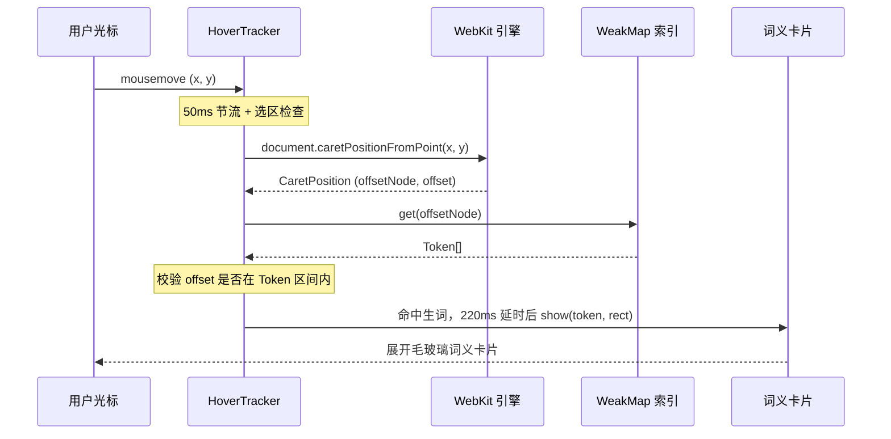
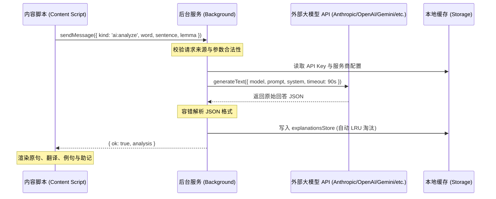

# Glint Safari Personal Edition - 核心系统架构设计 (Architecture)

## 一、架构设计理念：Safari-First & WebKit-First

本项目并非从 Chrome Extension 进行机械代码直译，而是立足于 **最新 WebKit / Safari Technology Preview** 的现代 Web 标准能力，重新设计的高性能、低开销个人专属架构。

```mermaid
flowchart TD
    subgraph WebPage["网页执行上下文 (Host Page & Isolated World)"]
        DOM["宿主网页 DOM 树"]
        subgraph ContentScript["Content Script (轻量化注入)"]
            Scanner["增量脏节点扫描引擎 (Incremental Scanner)"]
            HighlightAPI["CSS Custom Highlight 渲染引擎"]
            Hover["CaretPosition 悬停探测 (WeakMap 索引)"]
            CardHost["Web Component 隔离宿主 (<glint-card>)"]
            ShadowCard["毛玻璃词义卡片 (Shadow DOM)"]
        end
    end

    subgraph ExtensionBackground["后台服务 (Background Service Worker)"]
        Router["运行时消息路由 (Message Dispatcher)"]
        KeyStore["API 密钥安全隔离区 (apiKeysStore)"]
        AIRunner["AI SDK 客户端 (多模型抽象适配)"]
        DictService["本地 5.7 万词典懒加载查询"]
    end

    subgraph ExtensionUI["扩展前台界面 (Extension Pages)"]
        Popup["工具栏快捷弹窗 (Popup UI)"]
        Options["选项设置与实时沙盒 (Options UI)"]
    end

    DOM -->|DOM 变动事件| Scanner
    Scanner -->|生成 Ranges| HighlightAPI
    HighlightAPI -.->|原生绘制高亮 (无 DOM 插入)| DOM
    DOM -->|鼠标移动坐标| Hover
    Hover -->|命中 Token| CardHost
    CardHost -->|装配内容| ShadowCard
    
    ContentScript <-->|IPC 消息通信| Router
    Popup <-->|IPC 消息通信| Router
    Options <-->|IPC 消息通信| Router
    
    Router --> DictService
    Router --> KeyStore
    Router --> AIRunner
```

---

## 二、关键子系统架构设计

### 1. 增量脏节点扫描引擎 (Incremental DOM Scanner)
* **核心问题**: 原始实现每当网页发生任何 DOM 变动，均通过 `setTimeout(..., 500)` 对整页 `document.body` 执行 100% 完整扫描。在现代 SPA、动态打字机或无限滚动页面中，频繁触发全页正则匹配和 TreeWalker，造成严重的 Long Task 和高 CPU 占用。
* **Safari-First 重构方案**:
  - **初次扫描 (Initial Scan)**: 仅在首屏空闲时 (`requestIdleCallback`) 执行一次全页快速遍历，提取初始 `Token[]`。
  - **增量 Mutation 批处理 (Incremental Batching)**:
    - `MutationObserver` 仅收集发生改变的子树根节点与变动 Text 节点。
    - 针对变动列表进行祖先合并去重（若父节点已在扫描队列中，子节点自动省略）。
    - 仅对脏子树进行 `TreeWalker` 扫描，计算出受影响区域的 Token 差集。
  - **高频打字与流式文本防抖**:
    - 在打字机流式输出时，将连续微小变化合并为单一周期处理，确保主线程执行时间 `< 5ms`。

### 2. 内存安全倒排索引 (WeakMap-based Hover Index)
* **核心问题**: 原始 `HoverTracker` 使用普通 `Map<Text, Token[]>` 记录 Text 节点引用。一旦宿主页面框架（如 React/Vue）移除对应节点，该节点无法被垃圾回收，造成典型的孤立 DOM 树内存泄露 (Detached DOM Tree Leak)。
* **Safari-First 重构方案**:
  - 核心节点索引迁移至 `WeakMap<Text, Token[]>`，Text 节点在被页面销毁时自动解除关联，垃圾回收率达到 100%。
  - 屏幕坐标命中探测统一采用现代 WebKit 标配的标准 API: `document.caretPositionFromPoint(x, y)`，提取其 `offsetNode` 与 `offset` 进行区间校验。



### 3. 原生 CSS Custom Highlight 渲染引擎
* **架构机制**:
  - 利用 WebKit 原生支持的 `CSS.highlights` 集合管理。
  - 维持 `Range` 对象列表与活跃生词对应，全生命周期**零 DOM 修改**。
  - 样式通过 `document.adoptedStyleSheets` 动态挂载，利用 `color-mix(in oklch, ...)` 自适应深色/浅色网页主题。

### 4. Shadow DOM 词义卡片与视觉渲染
* **宿主隔离**: 卡片作为独立 Custom Element `<glint-card>` 挂载于 `document.body`，内部使用 Open Shadow DOM。
* **WebKit 原生硬件加速**:
  - 卡片背景应用 `-webkit-backdrop-filter: blur(24px) saturate(180%)`，依托 macOS 系统 GPU 呈现与 Safari 工具栏一致的原生毛玻璃质感。
* **智能自适应避让算法 (`pickSide`)**:
  - 动态计算视口剩余上下空间，当鼠标踩在卡片上触发 AI 生成（卡片高度突增）时，实施严格选边锁定 (`locked`)，坚决杜绝因重新选边导致卡片在光标下“瞬间跳走”。

### 5. 后台路由与安全边界隔离 (Background Service Worker)
* **API Key 安全隔离区**:
  - API Key 仅保存在 `local:apiKeys` 中，模块引用严格限制在 `background` 与 `options`。
  - Content Script 无权访问密钥存储，仅能发起 `dict:lookup` 或 `ai:analyze` 等受控指令。
* **AI 语境请求全流程**:



---

## 三、数据分层与状态管理架构

| 数据层次 | 生命周期 | 存储介质 | 读写特性 |
| :--- | :--- | :--- | :--- |
| **静态大词典 (Dictionary)** | 扩展包打包随附 | `public/data/dict.json` (3.6MB) | 后台按需一次性懒加载，内存常驻，只读 |
| **考纲词表 (Exam Lists)** | 扩展包打包随附 | `public/data/exams.json` (255KB) | 备考模式开启时按需拉取，只读 |
| **基础词汇表 (Lexicon)** | 打包内置 | `src/assets/lexicon.json` | 前台分词查询，启动时惰性初始化 |
| **用户配置 (Settings)** | 永久持久化 | `browser.storage.local: "local:settings"` | 多标签页监听广播更新，读多写少 |
| **已认识生词 (Known Words)**| 永久持久化 | `browser.storage.local: "local:knownWords"`| 数组集合，支持导入合并与单项撤销 |
| **AI 语境释义缓存** | 永久持久化 (LRU) | `browser.storage.local: "local:explanations"`| 上限 2000 条，基于时间戳自动淘汰 |
| **瞬态交互状态 (Transient)**| 页面会话级 | Content Script 内存 (WeakMap, Token[]) | 随页面关闭自然销毁，无需持久化 |

---

## 四、安全与防御架构 (Security by Design)

1. **Prompt Injection 与 XSS 防护**:
   - 网页提取的原句与单词仅作为字符串放入 LLM Prompt 的明确隔离段落，不与系统指令混淆。
   - 所有来自外部网络或模型吐出的字段，在渲染至 Shadow DOM 前必须经过强制转义，禁止裸 HTML 拼接。
2. **CSP 策略**:
   - 扩展上下文禁止加载外部未经授权的脚本与动态代码执行 (`eval`)。
3. **网络边界控制**:
   - 所有外网 LLM 通信必须经过 Background 代理发出，避免在 Content Script 暴露网络端点或违背宿主页面的 CSP 规则。
