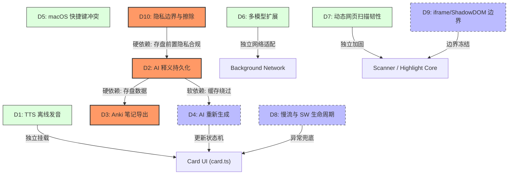

# Glint Safari Personal Edition — Milestone 5 Architecture Decision Gate

**文档类型**: 架构决策准入与候选工作流全景规划文档 (Architecture Decision Gate)  
**当前状态**: **DECISION GATE OPEN — AWAITING USER DECISIONS**  
**基线分支**: `safari-personal`  
**基线 Commit**: `fc9dd5b`  
**生产代码状态**: **0 FILES MODIFIED / 0 LINES TOUCHED IN `src/`**  

---

## 1. 执行摘要与决策准则 (Executive Summary & Principles)

在 Milestone 1（扫描与高亮）、Milestone 2（悬浮卡片）、Milestone 3（最小安全网络切片）与 Milestone 4（Anthropic SSE 流式打字机闭环）相继交付并完成 Safari Technology Preview (Release 253) 实机验证后，Glint Safari Personal Edition 具备了核心阅读与释义功能。

在进入 **Milestone 5 (Dynamic Web & Safari Compatibility)** 之前，前置审计（`docs/m5-feature-gap-audit.md`）识别出了 9 项关键差距与风险点：
1. TTS 原生离线发音 UI 入口缺失
2. AI 释义本地持久化 (`local:explanations`) 未接入流式结果
3. Anki TSV 导出因持久化缺失而断链
4. AI 重新生成 (Regenerate / Redo) 缺失
5. 多模型服务商 (Multi-Provider) 尚未扩展流式支持
6. macOS 平台快捷键 `Option+G` / `Option+Shift+G` 系统输入冲突
7. 巨型 SPA / 无限滚动长列表极端动态性能与内存稳定性
8. iframe / Shadow DOM 支持边界
9. Safari TP 极端慢流/停流与 Service Worker 生命周期边界

### 第一准则 (Cardinal Principles)
* **严禁替用户做决定**：本报告提供客观事实、技术推演、边界分析与候选方案，**决策权 100% 归属于用户 (USER)**。
* **零生产代码变更**：本阶段不修改 `src/`，不新增功能，不修复 Bug，不引入依赖，不修改 Manifest。
* **事实优先**：所有技术陈述均直接引用代码实现、WebExtension 规范及 WebKit/Safari 平台实测表现。

---

## 2. 决策登记表 (Decision Register)

| ID | Decision | Current State | Options | Technical Impact | Privacy Impact | Performance Impact | Scope | Decision Owner |
| :--- | :--- | :--- | :--- | :--- | :--- | :--- | :--- | :--- |
| **D1** | **TTS 原生离线单词发音恢复** | `src/lib/speak.ts` 已实现，但 `card.ts` 缺少小喇叭按钮与事件挂载 | **A.** 卡片直接绑定 `speak()`<br>**B.** 引入专用语音控制器管理状态与生命周期<br>**C.** 暂不恢复，保持静音 | A 极简，B 具备取消与状态追踪；需处理 WebKit 离线语音表异步装载 | 零网络、零权限、零隐私风险（严格限定 `localService: true`） | 点击时异步发音，零主线程阻塞；DOM 增加 1 个按钮节点 | Content / Card UI | **USER** |
| **D2** | **AI 语境释义本地持久化 (Cache)** | 仅在卡片内存展示，`explanationsStore` 未接入，页面刷新后丢失 | **A.** 恢复 `local:explanations`（2000 条 LRU 存盘）<br>**B.** 仅保持 Session 内存缓存<br>**C.** 彻底不缓存，每次显式重新请求 | 需定义流式文本与结构化 Analysis 兼容规范；涉及存储写入时机与命中状态机 | 敏感网页上下文句子进入持久化存储；需提供用户清空机制 | 缓存命中可免去 1~3 秒网络等待与 API 费用；读写有微小 storage 开销 | Background / Port / Storage / Card | **USER** |
| **D3** | **Anki 笔记导出连通性** | `src/lib/anki.ts` 与选项页导出按钮完备，但因 D2 未存盘导致导出 0 条 | **A.** 依赖 D2 存盘数据导出完整卡片（含原句与释义）<br>**B.** 降级支持仅导出单词与本地词典（无 AI 语境）<br>**C.** 暂不启用导出功能 | 方案 A 保持原版高级体验；方案 B 需调整 `AnkiRow` 字段可选容错 | 导出的 TSV 包含用户阅读的原句上下文；需由用户主动触发下载 | 导出在选项页一次性生成，对浏览主流程零性能影响 | Options / Storage / Anki | **USER** |
| **D4** | **AI 释义重新生成 (Regenerate)** | 仅支持失败/取消时的“重试”，无覆盖已有成功结果的“重新生成” | **A.** 复用现有 `AI_START` 协议，卡片增加重新生成按钮并绕过缓存<br>**B.** 扩展协议增加 `forceRefresh` 字段<br>**C.** 暂不支持重新生成，保留单次生成 | 方案 A/B 需在同一 Port 上安全 abort 前序请求并递增 `requestId`；需处理旧缓存覆盖逻辑 | 无新增隐私风险 | 重新触发一次 API 调用与流式渲染 | Content / Card / Port | **USER** |
| **D5** | **macOS 键盘快捷键冲突治理** | `wxt.config.ts` 默认 `Alt+G` / `Alt+Shift+G`，macOS 下为 Option 产生死键冲突 | **A.** 针对 macOS 声明专有键位（如 `Command+Shift+G`）<br>**B.** 改用 `Ctrl+G` / `Ctrl+Shift+G`<br>**C.** 移除默认快捷键，仅允许用户在 Safari 中自定义<br>**D.** 保持原样不作调整 | 需在 manifest `commands.suggested_key` 中添加 `mac` 平台专有映射，并排查可编辑元素输入保护 | 无隐私影响 | 纯键盘事件路由，零运行时性能负担 | Manifest / Background / Keynav | **USER** |
| **D6** | **多 AI 服务商流式支持扩展** | 仅 Anthropic SSE 实现了流式网络层，其余服务商未接入流式 | **A.** 统一抽象 Provider Stream Adapter 接口<br>**B.** 保持 Anthropic 专属，暂不扩展其余服务商<br>**C.** 逐步接入 OpenAI / DeepSeek 等主流兼容器 | 方案 A 具备高扩展性但测试矩阵成倍扩大；方案 B 保持架构极致收敛 | 涉及多域名 optional host permissions 申请与 API Key 隔离 | 各服务商 SSE 协议解析差异微小，内存开销可控 | Network / Background / Options | **USER** |
| **D7** | **极端动态网页扫描韧性 (Dynamic Web)** | 40ms 防抖增量扫描，变动 >250 条降级全量重扫；未在重型网站深度实测 | **A.** 开展 13 类典型动态页面自动化与实机基准测试并强化边界<br>**B.** 建立富交互编辑器/设计工具内置黑名单（如 Google Docs）<br>**C.** 维持现状，仅作为后续观察项 | 需设计长列表无限滚动、虚拟列表、高频实时日志等压力场景测试 | 无隐私影响 | 关键防线：确保动态增量扫描不突破 16ms 帧预算，杜绝 Long Task | Scanner / Content / MutationObserver | **USER** |
| **D8** | **WebKit Service Worker 慢流存活** | 处于 `UNVERIFIED` 状态；缺乏 WebKit 对空闲长连接不杀活的官方保证 | **A.** 接受限制：依赖 Port 断开异常脱敏提示并支持一键重试<br>**B.** 增设客户端/服务端 60s 确定性超时安全熔断<br>**C.** 重构传输层（改在 Content Script 内直接发起 fetch，需全域权限） | 严禁引入 keep-alive hack；方案 A/B 实现最小且安全；方案 C 破坏最小权限原则 | 方案 C 需索要广泛 host permissions，严重降低隐私防护 | 超时熔断可防止资源长期挂死 | Network / Port / Background | **USER** |
| **D9** | **iframe 与 Shadow DOM 支持范围** | 仅注入 top frame；宿主 Shadow DOM 内部不可见且 CSS 高亮不穿透 | **A.** 明确划定边界：仅支持顶级文档散文，不对嵌套 iframe/Shadow DOM 穿透<br>**B.** 探索 `all_frames: true` 针对同域 iframe 的受限支持<br>**C.** 探索 open Shadow DOM 递归遍历与样式挂载 | 穿透 Shadow DOM 会遇到 `caretPositionFromPoint` 盲区与 CSS Custom Highlight 跨 root 注册复杂性 | 无新增隐私风险 | 递归遍历 Shadow DOM 显著增加扫描与监听开销 | Manifest / Scanner / Highlight / Hover | **USER** |
| **D10** | **AI 上下文与本地缓存隐私边界** | `sentenceAround`（最大 260 字符）随释义暂存于内存，未落盘 | **A.** 严格本地持久化，增加用户一键擦除与禁用缓存开关<br>**B.** 仅缓存通用词典解释，严禁持久化网页上下文单句<br>**C.** 纯会话内存缓存，浏览器标签关闭即刻销毁 | 方案 A 保持体验完整但存盘敏感句子；方案 B 保护隐私但削弱 Anki 背卡原句价值 | 持久化网页原句可能记录用户私密浏览记录（邮件/文档） | 无显著性能差异 | Storage / Settings / Anki | **USER** |

---

## 3. 核心决策深度技术审查 (Deep-Dive Analysis)

### 3.1 D1 — 原生离线单词发音 (TTS)

#### 3.1.1 现状与代码核查
- `src/lib/speak.ts` 已完备实现：
  - 调用原生 `window.speechSynthesis` 与 `SpeechSynthesisUtterance`。
  - 严格离线原则：通过 `pickVoice()` 过滤 `v.localService === true` 且语言为 `en*` 的本机语音，绝不使用 Google/Apple 网络远程合成，零流量、零权限、零隐私泄露。
  - 语速锁定 `RATE = 0.9`；每次发音前强制执行 `speechSynthesis.cancel()` 排空前序排队语音。
  - 模块加载时执行 `if (hasAPI) speechSynthesis.getVoices()` 预热语音列表。
- `src/lib/card.ts` 现状：
  - 音标行 `this.phoneticEl` 仅展示文本 `/${entry.phonetic}/`，完全没有喇叭按钮，也没有绑定发音事件。

#### 3.1.2 Safari Technology Preview 运行机制与平台约束
- **权限模型**: Web Speech API（语音合成）在 Safari 中为免权限 API，无需扩展声明任何 permissions。
- **自动播放限制 (Autoplay Restriction)**: Safari 对音频与语音有严格的用户手势约束。由于发音仅在用户**显式点击喇叭按钮**这一直接手势（User Gesture）中触发，完全不受 Autoplay 限制阻拦。
- **运行上下文**: 完全在 Content Script（Card Shadow DOM）宿主上下文运行，无需与 Background Service Worker 通信。
- **主线程影响**: `speechSynthesis.speak()` 在 WebKit 内部是异步委托给 macOS 系统 `SpeechSynthesisServer` 守护进程，非阻塞主线程。
- **导航与清理**: 页面导航或卸载时应调用 `speechSynthesis.cancel()` 避免后台悬挂朗读。

#### 3.1.3 候选实现方案比较

```text
方案 A: Card 内部直接静态绑定 speak(token.word)
方案 B: 封装独立 SpeechController 管理就绪态、播放态与错误降级
```

| 评估维度 | 方案 A (直接绑定 speak) | 方案 B (独立 SpeechController) |
| :--- | :--- | :--- |
| **架构复杂度** | **S (极低)**：卡片添加 button，点击直接调 `speak(word)` | **M (中等)**：卡片引入控制器，管理播放中动画与事件回调 |
| **风险等级** | **LOW**：逻辑简单，无副作用 | **MEDIUM**：WebKit 的 `onend` / `onerror` 事件在特定版本可能丢失触发 |
| **测试要求** | Happy-DOM 下 mock `speechSynthesis`，验证点击与 cancel 调用 | 需完整 mock 事件派发状态机与多音频并发序列 |
| **Safari 不确定性** | 首张卡片弹出时语音表未异步加载完成可能不展示喇叭 | 需监听 `voiceschanged` 动态刷新喇叭显示状态 |

---

### 3.2 D2 — AI 语境释义本地持久化 (AI Explanation Persistence)

#### 3.2.1 存储现状与 Schema 审查
`src/lib/settings.ts` 中已定义：
```ts
export const explanationsStore = storage.defineItem<Record<string, Explained>>(
  'local:explanations',
  { fallback: {} },
);
export const EXPLANATION_LIMIT = 2000;
```
`Explained` 与 `Analysis` 的数据结构（`src/lib/types.ts`）：
```ts
export interface Explained {
  sentence: string;      // 词汇所在单句（最大 260 字符）
  surface?: string;      // 页面呈现形态（如 strata）
  analysis: Analysis;    // 细粒度结构化释义
  time: number;          // 生成时间戳
}
```
**关键冲突**：Milestone 4 交付的流式网络层返回的是**纯文本打字机流**，而历史 Schema 要求的是结构化 `Analysis`（包含 `sense`, `en`, `note`, `sentenceZh`, `example` 等）。

#### 3.2.2 核心决策点分析

##### (1) 保存什么数据 (Data Payload)
- 方案 1：纯文本格式。仅保存 `word`, `sentence`, `text: string`, `time`。
  - 优点：与 M4 流式输出 100% 契合，无需解析。
  - 缺点：破坏 `Analysis` 结构，导致原版设置页格式化展示和 Anki 导出模板需要重构。
- 方案 2：结构化解析。模型输出遵循轻量标签或分段规则，收尾时解析为 `Analysis` 对象存盘。
  - 优点：无缝兼容历史数据与 Anki 导出。
  - 缺点：需要轻量解析器；若模型输出格式偏离需具备纯文本降级容错。

##### (2) 存储键设计 (Cache Key)
| 候选 Key 格式 | 命中率 (Hit Rate) | 过期风险 (Stale Risk) | 隐私暴露 (Privacy) | 存储空间 (Size) |
| :--- | :--- | :--- | :--- | :--- |
| `word` (原型，原版方案) | **最高** (同一词跨文章均命中) | **高** (换了新语境，旧句子的意思可能不适用) | **最低** (不包含句子作为索引) | 最小 (~1.6MB / 2000 条) |
| `word + sentenceHash` | **低** (仅在完全相同原句中命中) | **极低** (语境完全对齐) | **中** (索引绑定句子特征) | 中等 (需额外存哈希) |
| `word + provider + model` | **中等** (切换模型即失效) | **高** (仍跨句子) | **最低** | 较大 (多模型冗余) |

##### (3) 生命周期与写入时机 (Lifecycle)
- **写入位置**: 由 Background Service Worker 在流式完整结束并向 Port 发送 `AI_DONE` 时写入，还是由 Content Script 在收到 `AI_DONE` 后调用存储写入？
  - *分析*: Background 写入更安全，即便 Content Script 在推流最后一刻关闭，已完成的 token 仍能安全存盘。
- **异常边界**:
  - 用户中途取消 (`AI_ABORT`)：**绝对不写入**局部残缺文本。
  - 网络报错 (`AI_ERROR`)：**绝对不写入**报错信息。
  - 4000 字符超限截断：是否存盘需明确（建议存盘截断内容并标注已截断，或拒绝存盘）。
  - 同 Port 替换 / 多 Tab 并发：需通过 `requestId` 严格核实，仅最新且正常的完成态才可存盘。

##### (4) 隐私边界 (Privacy Implications)
- **原句存盘风险**：`sentence` 字段记录了用户阅读时的真实句子。若用户阅读私人信件、内网保密文档，该句子会被永久写入本地 SQLite 存储。
- **必要配套机制**：必须具备“清空全部释义记录”、“删除单条词汇记录”功能，并允许用户在设置中关闭“保存 AI 释义记录”。

---

### 3.3 D3 — Anki 笔记导出连通性 (Anki Export)

#### 3.3.1 依赖链路与 Schema
当前数据流依赖拓扑：
```text
[ 用户点击 AI 解释 ]
         ↓
[ 流式推流完成 (AI_DONE) ]
         ↓ (当前断裂点)
[ explanationsStore (local:explanations) ]
         ↓
[ 设置页 Options / anki.ts ]
         ↓
[ toAnkiTSV(rows) 导出纯文本 .txt ]
```
- **TSV 格式标准**:
  - Header: `#separator:tab`, `#html:true`, `#notetype:Basic`, `#deck:Glint`, `#tags column:3`
  - Front: 单词 + 音标 (HTML)
  - Back: `analysis.sense` + 英文释义 + 词典释义 + **原句 (boldWord 加粗目标词)** + 原句翻译 + 例句 + 助记
  - Tags: `glint glint::<Level> glint::<Exam>`

#### 3.3.2 关键依赖问题
- **能否导出没有 AI 解释的生词？**
  原版设计中，Anki 仅导出“用户花过钱、且带有真实阅读原句的生词”。若要支持导出未经 AI 解释的纯本地词库生词，需重构 Anki 数据模型并设计无原句时的默认卡片正面/背面。
- **数据隐私**: 导出的 TSV 包含未加密的上下文句子，用户导入 AnkiWeb 时可能同步至第三方云端。设置页需显式提示用户检查内容。

---

### 3.4 D4 — AI 语境释义重新生成 (AI Regenerate)

#### 3.4.1 协议与状态机分析
当前流式通信协议：
- 客户端: `AI_START { word, lemma, sentence }`, `AI_ABORT { requestId }`
- 服务端: `AI_CHUNK { requestId, text }`, `AI_DONE { requestId }`, `AI_ERROR { requestId, code, message }`

#### 3.4.2 重新生成的关键问题
- **协议层面**: 重新生成本质上是携带新递增 `requestId` 的 `AI_START`，**无需扩展底层 Port 消息类型**。
- **缓存穿透 (Cache Bypass)**: 若 D2 启用了持久化，卡片打开时已展示缓存内容，点击“重新生成”必须显式触发后台绕过缓存重新发起 HTTPS 请求，并在完成后覆盖旧缓存。
- **前序请求未决**: 若用户在前一次流式尚未完成时点击“重新生成”，Card UI 必须先调用 `aiClient.abort()` 掐断旧连接，再发起新的 `AI_START`。
- **UI 状态迁移**: 需在卡片展示已完成释义或缓存释义时，常驻展示一个次级图标/按钮“重新解释”。

---

### 3.5 D5 — macOS 键盘快捷键冲突 (macOS Shortcuts)

#### 3.5.1 冲突根因与机制
在 `wxt.config.ts` 中当前配置为：
```json
"commands": {
  "next-word": { "suggested_key": { "default": "Alt+G" } },
  "prev-word": { "suggested_key": { "default": "Alt+Shift+G" } }
}
```
- **macOS 系统级死键与符号冲突**：
  在 macOS 英文输入法下：
  - `Option+G` 原生输出版权符号 `©`。
  - `Option+Shift+G` 原生输出双锐音符 `˝`。
  当光标位于网页文本框（`<input>`, `<textarea>`, `contenteditable`）时，若扩展命令未完全拦截，将向输入框写入特殊符号或引发输入法紊乱。
- **Safari WebExtensions 规范支持**：
  Manifest `commands` 支持平台专用字段：
  ```json
  "suggested_key": {
    "default": "Alt+G",
    "mac": "Command+Shift+G" // 或 "MacCtrl+G"
  }
  ```
- **备选方案比较**:
  - 方案 1: `mac: "Command+Shift+G"`（注意：在浏览器中 Cmd+G 常用于“查找下一个”，Cmd+Shift+G 用于“查找上一个”，可能与 Safari 页面搜索冲突）。
  - 方案 2: `mac: "Ctrl+G"` / `mac: "Ctrl+Shift+G"`（在 macOS 上 Control 键与系统级快捷键冲突较少）。
  - 方案 3: 保持命令注册但不预设 `suggested_key`，交由用户在系统偏好中自行配置。

---

### 3.6 D6 — 多模型服务商生态扩展 (Multi-Provider Architecture)

#### 3.6.1 官方 API 能力矩阵

| Provider | Auth Header | Endpoint | Streaming Protocol | Event Chunk Format | Model Discovery | Optional Origin | Privacy / Key Isolation |
| :--- | :--- | :--- | :--- | :--- | :--- | :--- | :--- |
| **Anthropic** | `x-api-key`<br>`anthropic-version: 2023-06-01` | `https://api.anthropic.com/v1/messages` | SSE (`text/event-stream`) | `content_block_delta`<br>`delta.type === 'text_delta'` | `GET /v1/models` | `https://api.anthropic.com/*` | Background 独立内存持有，Header 鉴权，URL 零 Key |
| **OpenAI** | `Authorization: Bearer <key>` | `https://api.openai.com/v1/chat/completions` | SSE (`text/event-stream`) | `data: {"choices":[{"delta":{"content":"..."}}]}`<br>收尾: `data: [DONE]` | `GET /v1/models` | `https://api.openai.com/*` | 同上 |
| **Google Gemini** | `x-goog-api-key: <key>` | `https://generativelanguage.googleapis.com/v1beta/models/{model}:streamGenerateContent?alt=sse` | SSE (`text/event-stream`) | `data: {"candidates":[{"content":{"parts":[{"text":"..."}]}}]}` | `GET /v1beta/models` | `https://generativelanguage.googleapis.com/*` | 严禁 Query `?key=`，改用官方请求头鉴权 |
| **DeepSeek** | `Authorization: Bearer <key>` | `https://api.deepseek.com/chat/completions` | SSE (兼容 OpenAI) | 兼容 OpenAI SSE 格式 | `GET /models` | `https://api.deepseek.com/*` | 同 OpenAI |
| **Ollama** | 无需鉴权或 Bearer | `http://localhost:11434/v1/chat/completions` | SSE (兼容 OpenAI) | 兼容 OpenAI SSE 格式 | `GET /api/tags` | `http://localhost:11434/*` | 本地环回地址，零数据外发风险 |

#### 3.6.2 架构演化路线选择
- **路线 A (统一 Provider Adapter 接口)**:
  定义 `interface ProviderStreamAdapter`，各家独立实现鉴权构造与 SSE 增量提取函数。
  *代价*: 需要为每家编写单独单元测试，维护成本高。
- **路线 B (Normalized Event Stream)**:
  将各家 SSE 原始流先映射为内部标准 Token Stream。
- **路线 C (保持 Anthropic 单一服务商)**:
  M5 暂不扩展其他服务商，专注把 Safari 上的卡片交互、缓存与动态网页做深做透。

---

### 3.7 D7 — 极端动态网页与长文档扫描韧性 (Dynamic Web Robustness)

#### 3.7.1 13 类典型 Web 场景支持矩阵

| 场景序号 | 页面类型与特征 | 当前支持度 | 证据与机制 | 潜在风险与痛点 | 建议测试方法 |
| :--- | :--- | :--- | :--- | :--- | :--- |
| **S1** | **常规散文静态文章** (Wikipedia, 博客) | **Supported** | M1~M4 实测完全覆盖；单次遍历，0 监听扰动 | 几乎无风险 | 自动化测试 + STP 实测 |
| **S2** | **超长静态文档** (>50,000 词，技术规范) | **Supported** | `MAX_TOKENS = 800` 截断，避免创建过多 Range | 前半部分词汇标满后，后半部分可能无法标注 | 注入超长 HTML 验证截断与内存消耗 |
| **S3** | **SPA 路由整页切换** (Next.js, Vite) | **Partially supported** | `records.length > 250` 自动降级为全量重扫 | 切换瞬间可能产生短暂空白或短暂并发扫描 | 模拟单页应用切换路由与 DOM 树完全替换 |
| **S4** | **无限滚动长列表** (Feeds) | **Partially supported** | 增量子树扫描只处理追加节点 | 随着页面无限变长，脱离视口的 Token 是否会造成 Range 累积 | 连续触发 50 次批量追加测试内存变化 |
| **S5** | **React 虚拟 DOM 高频更新** | **Supported** | 40ms 防抖批处理合并微更新 | 若 React 组件频繁 unmount/mount 相同文本，引发频繁重新扫描 | 模拟 500 次 React 节点切换与增删 |
| **S6** | **Vue 响应式文本变动** | **Supported** | `characterData` 增量识别 `dirtyTextNodes` | 文本更新触发单个 Text 节点重扫，开销极小 | 模拟实时打字机变动测试 |
| **S7** | **Angular Zone.js 微任务变动** | **Supported** | 同 Vue/React | 无特殊差异 | 模拟 DOM 批量插入 |
| **S8** | **实时高频滚动日志** (CI Console, Terminal) | **At Risk** | 每秒数十次 DOM 追加，可能导致 40ms 批处理定时器永远无法清空 | 持续占用主线程微任务队列，导致 CPU 飙升 | 模拟持续 10 秒以 20ms 间隔推送日志行 |
| **S9** | **虚拟化长列表** (Twitter, Reddit, 虚拟滚动) | **Partially supported** | DOM 节点随滚动不断被销毁并重新创建 | 滚出视口节点 `isConnected === false`，需依赖批处理及时清理 | 快速滚动虚拟列表，监控 WeakRef 与 Token 内存 |
| **S10** | **在线富文本编辑器** (Notion, Google Docs) | **Partially supported** | `scan.ts` 明确跳过 `contenteditable` 及其子节点 | Google Docs 采用 Canvas 渲染完全不可见；Notion 自研编辑器易受光标干扰 | 在输入状态下移动光标与输入英文 |
| **S11** | **代码高亮与代码块** (`<pre>`, `<code>`) | **Supported** | 完整跳过代码块，并将代码内单词计入页面黑话词表 | 逻辑严密，测试已覆盖 | 包含多语言代码块的复杂技术文章 |
| **S12** | **iframe 嵌入页面** | **Unsupported** | `wxt.config.ts` 设定 `all_frames: false`，仅注入 top frame | iframe 内部英文完全不标注 | 包含广告或嵌入式阅读器的页面 |
| **S13** | **宿主 Shadow DOM 节点** | **Unsupported** | `TreeWalker` 在 `document.body` 根节点上运行，不进入外部 Shadow Root | Web Components 封装的内容完全不被扫描 | 构建包含 open/closed Shadow Root 的测试页面 |

---

### 3.8 D8 — WebKit Service Worker 极端慢流/停流生命周期 (SW Lifecycle)

#### 3.8.1 平台事实与机制澄清
- **Safari MV3 规范事实**: Safari 扩展后台采用 Service Worker 运行。WebKit 官方文档与源码表明，SW 空闲挂起时间约为 **30 秒**。
- **活跃流维持机制**: 当 `fetch()` 处于活跃传输中时，底层任务保持 SW 活跃；但在弱网或模型深度思考（Thinking Time）超过 30 秒且无新 chunk 到达时，WebKit 是否会强行终止 SW，属于 **`UNVERIFIED`** 边界。
- **明确禁令**: **严禁在扩展中实现 setInterval fake heartbeat 或 dummy request**，这违反 Safari 扩展能效设计原则并可能导致 App Store 审核被拒或系统强杀。

#### 3.8.2 产品级容灾选择
- **选择 A (接受限制并优雅容灾)**:
  若发生 Service Worker 被杀或连接中断，Port 触发 `onDisconnect`，Card UI 安全转换为“连接异常中断”脱敏提示，并提供“重试”按钮。
- **选择 B (设置 60s 确定性超时安全熔断)**:
  在 `fetchProviderStream` 中设置 60s 总体超时（或 30s chunk 停流超时），超时后主动 abort 并通知 UI，避免无限转圈。

---

### 3.9 D9 — iframe 与 Shadow DOM 支持边界

#### 3.9.1 iframe 边界
- **跨域 iframe (Cross-Origin)**: 浏览器同源策略（Same-Origin Policy）绝对禁止父页面脚本直接读取或修改跨域 iframe 内的 DOM。
- **全页面注入 (`all_frames: true`) 的技术代价**:
  - 若开启 `all_frames: true`，每个微小 iframe（包括 1x1 广告像素、统计 frame）都会加载完整的 Glint Content Script，内存与 CPU 开销剧增。
  - 卡片在狭窄 iframe 内弹出时会被 iframe 视口物理截断，无法跨出 iframe 容器。
- **结论**: 明确维持 **仅支持 Top-Level Frame** 的架构边界。

#### 3.9.2 Shadow DOM 边界
- **Open Shadow DOM**: 理论上可通过递归扫描 `element.shadowRoot` 提取文本，但 `CSS.highlights` 作用域与 `caretPositionFromPoint` 在跨 Shadow 边界时光标命中失效。
- **Closed Shadow DOM**: JavaScript 无法获取 `shadowRoot`（返回 `null`），完全不可穿透。
- **结论**: 明确维持 **仅支持 Light DOM 散文文本** 的架构边界。

---

### 3.10 D10 — AI 上下文与本地持久化隐私边界

#### 3.10.1 隐私风险场景推演
当用户在阅读包含个人敏感信息（如网页端邮件、个人征信报告、公司未公开财报、私密聊天记录）时点击“AI 解释”：
1. 生词及其所在的单句（最大 260 字符）会被发往所配置的 AI 服务商。
2. 若启用了持久化存盘（D2），该单句和 AI 释义将永久写入本地浏览器的 `local:explanations`（未加密的 SQLite/plist 文件）。
3. 任何能接触到该电脑设备的人，通过打开 Glint 设置页或导出 Anki/备份，均能逐条查看这些敏感上下文。

#### 3.10.2 隐私防护技术手段
- **手段 1 (用户显式总开关)**: 设置页提供“允许将 AI 释义与语境例句保存在本地”开关（默认可配置为开启或关闭）。
- **手段 2 (一键完全擦除)**: 设置页提供明显的“清空所有已保存释义”红色按钮，以及单条删除按钮。
- **手段 3 (Anki 导出前置确认)**: 在导出 Anki TSV 时，弹窗明确提示“导出文件包含您阅读过的真实上下文句子，请妥善保管导出文件”。

---

## 4. Milestone 5 依赖拓扑图 (Dependency Graph)

各候选技术模块之间的逻辑依赖关系如下：



### 依赖关系分类说明：
- **Hard Dependency (硬依赖)**:
  - `D3 (Anki 导出)` **硬依赖** `D2 (AI 释义持久化)`：没有存盘数据，Anki 导出注定为空。
  - `D2 (持久化)` **硬依赖** `D10 (隐私边界)`：在决定落盘前，必须先确定敏感原句的存储策略与删除机制。
- **Soft Dependency (软依赖)**:
  - `D4 (重新生成)` **软依赖** `D2 (持久化)`：如果未启用持久化，重新生成仅是覆盖卡片当前内存状态；如果启用了持久化，重新生成还需覆盖存储。
  - `D8 (慢流存活)` **软依赖** `Card UI`：当 SW 被超时强杀时，卡片必须有对应的脱敏展示与重试状态。
- **Independent (独立解耦)**:
  - `D1 (TTS 离线发音)`：完全独立于 AI、网络与存储，仅依赖 Card DOM 与 Web Speech API。
  - `D5 (macOS 快捷键)`：完全独立，仅涉及 Manifest 配置与 `keynav.ts`。
  - `D6 (多服务商网络层)`：独立于前端 UI 与扫描逻辑。
  - `D7 (动态 Web 韧性)`：独立于 AI 与卡片，仅涉及 DOM 扫描器与 Mutation 队列。

---

## 5. M5 候选工作流详细规划 (Candidate Workstreams)

### M5-W1: TTS 原生离线发音恢复 (TTS Restoration)
- **Goal**: 在悬浮卡片音标旁恢复小喇叭按钮，点击调用离线 Web Speech API 朗读当前生词。
- **Scope**: `src/lib/card.ts`，补充发音按钮 DOM、CSS 与点击调用；页面卸载时清理未决发音。
- **Non-goals**: 不引入第三方神经网络 TTS，不引入网络远程语音合成，不朗读整句。
- **Files likely affected**: `src/lib/card.ts`, `tests/hover-card.test.ts`。
- **Architecture impact**: 纯前端 Card Shadow DOM 局部微调，零架构破坏。
- **Security impact**: 零安全隐患；严格限定 `localService: true`，零数据外发。
- **Performance impact**: 极小；异步发音无阻塞，DOM 增加 1 个 button 节点。
- **Safari-specific risk**: WebKit `getVoices()` 首次调用返回空数组的异步装载时差。
- **Automated tests**: mock `speechSynthesis` 验证点击调用、排队清空 (`cancel()`)、多次快速点击。
- **Safari TP tests**: 实机打开英文维基百科，点击喇叭确认能听到系统发音，连点两次确认不重复堆叠。
- **Acceptance criteria**: 卡片有音标时展示喇叭，点击即发出纯正美音，断网状态下依然可用。
- **Estimated complexity**: **S**
- **Dependencies**: 无（独立工作流）。
- **Rollback difficulty**: 极低（直接从卡片 DOM 移除按钮）。

---

### M5-W2: AI 释义本地持久化与 Anki 导出闭环 (AI Persistence & Anki)
- **Goal**: 将流式生成的 AI 释义在完成后持久化存入 `local:explanations`（2000 条 LRU），并在设置页打通 Anki TSV 导出。
- **Scope**: 
  - 定义流式结果与 `explanationsStore` 的存储规范；
  - Background 在推流成功结束时异步落盘；
  - Card 打开生词时若命中缓存直接呈现；
  - 设置页支持单条删除、全部清空与 Anki TSV 导出。
- **Non-goals**: 不实现复杂的云同步，不引入 SQLite 外部依赖，不修改 Anki TSV 格式。
- **Files likely affected**: `src/lib/ai-port.ts`, `src/lib/card.ts`, `src/lib/settings.ts`, `src/entrypoints/background.ts`, `src/entrypoints/options/main.ts`, 专项测试文件。
- **Architecture impact**: 贯穿 Background Port、Storage、Content Card 与 Options 页面。
- **Security impact**: 涉及用户阅读上下文原句落盘，需增加隐私保护提示与擦除入口。
- **Performance impact**: 每次 AI 请求成功后重写 storage（最大 1.6MB），发生在单次用户主动请求收尾阶段，开销完全可控。
- **Safari-specific risk**: Safari WebExtension `browser.storage.local` 写入配额与并发竞争。
- **Automated tests**: 缓存写入、LRU 2000 条淘汰、命中缓存秒显、清空缓存、Anki 导出字段正确性。
- **Safari TP tests**: 实机生成释义 -> 刷新页面悬停同一生词确认秒显 -> 选项页点击导出 Anki 并在 Anki 客户端实际导入成功。
- **Acceptance criteria**: 相同生词二次悬停零网络请求秒开；Anki 成功导入真实生词与语境例句。
- **Estimated complexity**: **L**
- **Dependencies**: D10 隐私策略。
- **Rollback difficulty**: 中等（需处理 storage 迁移与状态机回退）。

---

### M5-W3: AI 语境释义重新生成 (AI Regenerate)
- **Goal**: 对已经生成过释义或已命中本地缓存的生词，允许用户点击“重新生成”发起新的 AI 流式请求并覆盖旧缓存。
- **Scope**: Card UI 状态机支持 `done` 态下的次级操作入口；触发时递增 `requestId` 并安全重新发起 `AI_START`；成功后覆盖 storage。
- **Non-goals**: 不做多版本历史释义对比，不做生成分支树。
- **Files likely affected**: `src/lib/card.ts`, `tests/ai-card.test.ts`。
- **Architecture impact**: 完善 Card 内部 6 态状态机流转。
- **Security impact**: 无新增风险。
- **Performance impact**: 仅由用户显式点击触发，开销与常规 AI 请求相同。
- **Safari-specific risk**: 无。
- **Automated tests**: 验证重新生成按钮点击、旧状态排空、新流式打字机追加、完成后缓存覆盖。
- **Safari TP tests**: 实机针对已有缓存生词点击重新生成，确认旧文字清除、新文字打字机输出、最终落盘更新。
- **Acceptance criteria**: 用户可自主强制刷新不准确的释义。
- **Estimated complexity**: **M**
- **Dependencies**: M5-W2 (软依赖)。
- **Rollback difficulty**: 低。

---

### M5-W4: macOS 键盘快捷键冲突治理 (macOS Shortcut Compatibility)
- **Goal**: 消除 `Alt+G` / `Alt+Shift+G` 在 macOS 上触发 `Option` 系统特殊符号（`©`、`˝`）输入冲突。
- **Scope**: 
  - `wxt.config.ts` 中的 `commands` 配置根据用户决策调整；
  - `src/lib/keynav.ts` 补充输入框（`INPUT`, `TEXTAREA`, `contenteditable`）焦点判断与按键穿透保护。
- **Non-goals**: 不做复杂的用户自定义快捷键录制界面。
- **Files likely affected**: `wxt.config.ts`, `src/lib/keynav.ts`, 关联测试。
- **Architecture impact**: 极小。
- **Security impact**: 零。
- **Performance impact**: 零。
- **Safari-specific risk**: Safari 对扩展命令快捷键的处理优先级与系统键位映射。
- **Automated tests**: 模拟处于 input 状态下的按键事件冒泡与拦截测试。
- **Safari TP tests**: 在输入框内打字时按下快捷键，确认不会输入 `©`，且在正文中能稳定跳词。
- **Acceptance criteria**: 快捷键在文章中正常跳转生词并居中卡片，在编辑区域不干扰正常输入。
- **Estimated complexity**: **S**
- **Dependencies**: 无（独立工作流）。
- **Rollback difficulty**: 极低。

---

### M5-W5: 极端动态网页与长文档扫描韧性 (Dynamic Web Robustness)
- **Goal**: 针对 13 类典型动态 Web 场景建立深度基准测试，加固增量扫描与变动批处理队列，确保 0 卡顿、0 内存泄漏与 0 Long Task。
- **Scope**: 
  - `src/lib/scan.ts` 与 `src/entrypoints/content.ts` 变动队列边界保护；
  - 极端高频变更场景下的防抖节流与丢帧保护；
  - 补充超长文档、无限滚动与高频打字机场景的压力自动化测试。
- **Non-goals**: 不重构为 Web Worker 扫描（DOM 操作必须在主线程）。
- **Files likely affected**: `src/lib/scan.ts`, `src/entrypoints/content.ts`, `tests/mutation-stress.test.ts`。
- **Architecture impact**: 巩固扫描引擎的健壮性。
- **Security impact**: 零。
- **Performance impact**: 关键收益：杜绝极端动态页面引发的风暴式重绘与主线程卡死。
- **Safari-specific risk**: Safari WebKit `TreeWalker` 与 `CSS.highlights` 在超大节点规模下的 GC 表现。
- **Automated tests**: 模拟每秒 100 次持续变动、50,000 节点大页面、无限滚动追加。
- **Safari TP tests**: 实测 Twitter/X 信息流滚动、GitHub PR 巨型 Diff 页面、Notion 页面。
- **Acceptance criteria**: 动态页面滚动流畅（60fps），主线程无长任务警报，无孤立 DOM 内存泄漏。
- **Estimated complexity**: **M**
- **Dependencies**: 无（独立工作流）。
- **Rollback difficulty**: 低。

---

### M5-W6: iframe 与 Shadow DOM 支持边界加固 (iframe / Shadow DOM Boundary)
- **Goal**: 形式化冻结并加固 iframe 与宿主 Shadow DOM 的边界防护，确保扫描器遇到复杂组件化页面时不崩溃、不误判、不错位。
- **Scope**: 
  - 确保跨域/同域 iframe 安全忽略；
  - 强化 Shadow DOM 容器排除逻辑；
  - 补充边界防御测试用例。
- **Non-goals**: 不强行穿透跨域 iframe，不强行 hack closed Shadow DOM。
- **Files likely affected**: `src/lib/scan.ts`, `tests/incremental-scan.test.ts`。
- **Architecture impact**: 极小（防御性收敛）。
- **Security impact**: 强化隔离，避免跨域 DOM 越权异常。
- **Performance impact**: 避免无意义的递归穿透，降低不必要开销。
- **Safari-specific risk**: 无。
- **Automated tests**: 嵌套 iframe 测试、包含 open/closed Shadow Root 宿主测试。
- **Safari TP tests**: 访问包含嵌套 iframe 与 Web Components 的复合页面，确认无控制台红字报错。
- **Acceptance criteria**: 遇到复杂嵌套 DOM 结构平滑忽略，宿主散文文本正常标注。
- **Estimated complexity**: **S**
- **Dependencies**: 无。
- **Rollback difficulty**: 极低。

---

### M5-W7: 慢流与 Service Worker 生命周期韧性 (Slow Stream & SW Lifecycle)
- **Goal**: 在不引入任何 keep-alive 违规 Hack 的前提下，为极端慢流（>30s 停顿）提供确定的客户端超时安全熔断与异常重试机制。
- **Scope**: 
  - `src/lib/provider-network.ts` 增设确定性超时参数；
  - Background Port 断开时安全释放底层 fetch 并通知 Content Script；
  - Card UI 增加优雅中断恢复提示。
- **Non-goals**: 严禁引入 fake heartbeat、循环 fetch 等保活黑科技。
- **Files likely affected**: `src/lib/provider-network.ts`, `src/lib/ai-port.ts`, `src/lib/card.ts`。
- **Architecture impact**: 完善网络与连接容灾。
- **Security impact**: 无。
- **Performance impact**: 避免孤儿连接长期占用后台带宽与内存。
- **Safari-specific risk**: 验证 Safari WebExtension SW 在连接断开后的自动休眠表现。
- **Automated tests**: 模拟长时间静默流、30s 断开、Port 强制 disconnect 时的资源清理。
- **Safari TP tests**: 实机模拟弱网与慢响应，验证卡片提示与重试链路。
- **Acceptance criteria**: 遇到后台被杀或网络停滞时卡片不永久挂死，提示清晰且可一键重试。
- **Estimated complexity**: **M**
- **Dependencies**: 无。
- **Rollback difficulty**: 低。

---

### M5-W8: 多模型流式网络层统一抽象调查 (Multi-Provider Architecture Investigation)
- **Goal**: 设计统一的 Provider Stream 适配层接口，为后续引入 OpenAI / DeepSeek / Gemini 等流式输出建立架构原型。
- **Scope**: 
  - 评估 `interface ProviderStreamAdapter` 设计草案；
  - 编写 OpenAI 兼容流式解析原型与单测；
  - 梳理多服务商鉴权与单域权限申请联动。
- **Non-goals**: 本阶段不要求全部 11 家服务商一次性上线。
- **Files likely affected**: `src/lib/provider-network.ts`, `tests/provider-network.test.ts`。
- **Architecture impact**: 网络层重构为多策略模式。
- **Security impact**: 需严格确保各家鉴权 Header 隔离，URL 零 Key 泄露。
- **Performance impact**: 极小。
- **Safari-specific risk**: 各家不同 API 域名的 `optional_host_permissions` 动态申请兼容性。
- **Automated tests**: mock OpenAI / DeepSeek SSE 协议解析测试。
- **Safari TP tests**: 选用第二服务商进行单域授权与流式推流实测。
- **Acceptance criteria**: 具备清晰可插拔的 Provider 接入机制。
- **Estimated complexity**: **L**
- **Dependencies**: 独立。
- **Rollback difficulty**: 中等。

---

## 6. 实施顺序候选方案 (Sequencing Candidates)

为便于用户评估，提供三种不同业务倾向的实施路线（**客观陈述，不评判优劣**）：

### 候选路线 A: 功能闭环与体验补齐优先 (Sequence A: Feature Parity First)
```text
Step 1: M5-W1 (TTS 发音恢复)
Step 2: M5-W4 (macOS 快捷键治理)
Step 3: M5-W2 (AI 释义持久化 + Anki 导出)
Step 4: M5-W3 (AI 重新生成)
Step 5: M5-W5 (动态网页韧性加固)
```
- **前置条件**: 用户批准 D1 (TTS)、D2 (持久化方案)、D3 (Anki)、D4 (Regenerate)、D5 (快捷键)。
- **路线特征**: 迅速把原版 Chrome 扩展中备受好评的离线发音、释义缓存、Anki 导出和快捷键带回 Safari，用户可直接感知的功能完整性最高。
- **主要风险**: 需处理好 AI 缓存存盘的格式定义与敏感网页隐私合规。
- **架构影响**: 卡片与存储状态机大幅丰富，代码量适度增长。

---

### 候选路线 B: 页面稳定性与平台兼容优先 (Sequence B: Robustness & WebKit First)
```text
Step 1: M5-W5 (极端动态网页与长文档扫描韧性)
Step 2: M5-W6 (iframe / Shadow DOM 边界加固)
Step 3: M5-W7 (慢流与 Service Worker 生命周期韧性)
Step 4: M5-W1 (TTS 发音恢复)
Step 5: M5-W4 (macOS 快捷键治理)
```
- **前置条件**: 用户希望优先确保 Safari 浏览器在各大复杂网站（Twitter, GitHub, Notion 等）上的绝对稳定与 0 崩溃。
- **路线特征**: 先夯实底层地基，解决扫描器在高频 DOM 变动下的极端性能，再做外层功能补全。
- **主要风险**: 前期主要在补足压力测试与边界防御，用户可见功能变化较小。
- **架构影响**: 核心扫描引擎与生命周期管理更加坚固。

---

### 候选路线 C: 多模型生态与网络扩展优先 (Sequence C: Multi-Provider Expansion)
```text
Step 1: M5-W8 (多模型流式架构抽象与第二服务商接入)
Step 2: M5-W1 (TTS 发音恢复)
Step 3: M5-W2 (AI 释义持久化)
Step 4: M5-W5 (动态网页韧性加固)
```
- **前置条件**: 用户希望在 Safari 上能使用 OpenAI / DeepSeek / 本地 Ollama 等不同模型。
- **路线特征**: 突破 Anthropic 单一服务商限制，丰富模型生态。
- **主要风险**: 网络适配与权限申请测试矩阵成倍增加，不同服务商的 SSE 异常形态多。
- **架构影响**: 网络层进行策略模式抽象重构。

---

## 7. Milestone 5 Step 1 入口条件 (M5 Step 1 Entry Criteria)

在正式启动 **Milestone 5 Step 1** 生产代码开发之前，必须满足以下所有准入检查项：

- [ ] **用户决策已裁定 (User Decisions Completed)**:
  - [ ] **D1 (TTS)**: 是否恢复发音？采用直接绑定还是独立控制器？ (`BLOCKED ON USER DECISION`)
  - [ ] **D2 (AI Persistence)**: 是否恢复 `local:explanations`？纯文本还是结构化 Analysis？是否跨页面？ (`BLOCKED ON USER DECISION`)
  - [ ] **D3 (Anki)**: 是否恢复 Anki 导出？是否仅限已解释生词？ (`BLOCKED ON USER DECISION`)
  - [ ] **D4 (Regenerate)**: 是否在卡片加入“重新生成”？ (`BLOCKED ON USER DECISION`)
  - [ ] **D5 (Shortcut)**: 是否调整 macOS 快捷键？具体键位是？ (`BLOCKED ON USER DECISION`)
  - [ ] **D6 (Multi-Provider)**: 是否扩展第二服务商？目标服务商是？ (`BLOCKED ON USER DECISION`)
  - [ ] **D7 (Dynamic Web)**: 是否作为本次 M5 核心加固主线？ (`BLOCKED ON USER DECISION`)
  - [ ] **D8 (Slow Stream)**: 是否接受 WebKit SW 限制并增设 60s 确定性超时？ (`BLOCKED ON USER DECISION`)
  - [ ] **D9 (iframe/Shadow DOM)**: 是否确认维持仅 Top Frame 散文边界？ (`BLOCKED ON USER DECISION`)
  - [ ] **D10 (Privacy)**: 本地持久化原句的隐私策略与擦除选项是否批准？ (`BLOCKED ON USER DECISION`)
- [ ] **实施路线已选择 (Sequencing Selected)**: 用户明确指定执行 Sequence A、B、C 或自定义组合 (`BLOCKED ON USER DECISION`)。
- [ ] **Step 1 实施范围已冻结 (Scope Frozen)**: 仅允许包含当前 Step 的最小原子闭环，严禁跨 Step 提前编码。
- [ ] **验收标准与测试用例已明确 (Acceptance Criteria Written)**: 具备量化的自动化与实机验收指标。
- [ ] **安全与隐私审查已过审 (Security & Privacy Cleared)**: 确认 API Key 隔离与上下文边界无泄露风险。
- [ ] **回滚策略已完备 (Rollback Strategy Defined)**: 单步变更具备清晰独立的 Git 撤销路径。

---

## 8. 必须由用户裁决的核心事项 (Strictly Reserved for User)

以下产品与架构方向**绝对不替用户做决定**，必须由用户审阅本报告后逐一指令：

1. **TTS 是否恢复？**
2. **AI 释义是否恢复本地持久化 (`local:explanations`)？**
3. **Anki 导出是否恢复？**
4. **卡片是否加入“重新生成”按钮？**
5. **macOS 快捷键是否调整，调整为什么组合？**
6. **是否扩展第二 Provider（如 OpenAI、DeepSeek、Gemini）？**
7. **动态网页极端性能加固与功能补齐的优先级次序？**
8. **是否接受 Safari SW 慢流限制并仅做超时脱敏？**
9. **M5 实施顺序采用 Sequence A、B、C 还是自定义顺序？**

---

## 9. 准入结论 (Verdict)

* **阶段状态**: **M5 ARCHITECTURE DECISION GATE ESTABLISHED**  
* **生产代码状态**: **0 MODIFICATIONS (`src/` 保持 100% 干净未动)**  
* **文档交付物**: [`docs/m5-architecture-decision-gate.md`](file:///Users/ada/Downloads/glint-main/docs/m5-architecture-decision-gate.md)  
* **后续动作**: **STOP — 等待用户完成架构决策与路线裁定**。
